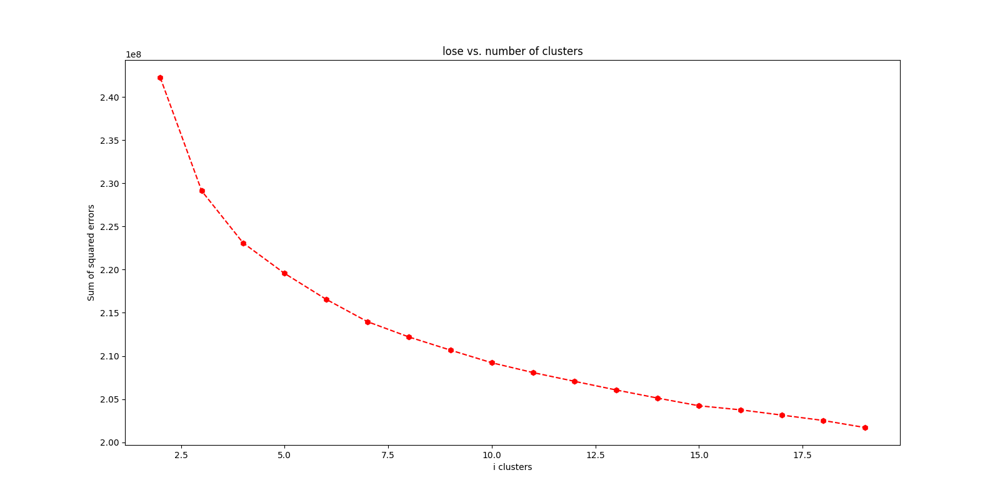
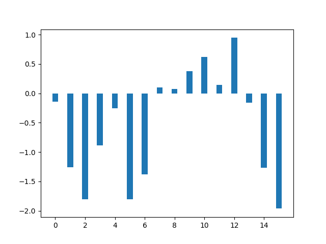
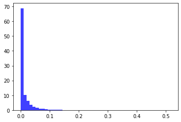
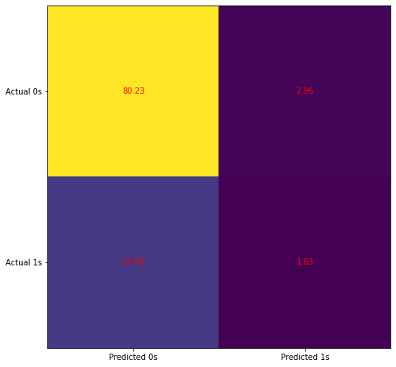
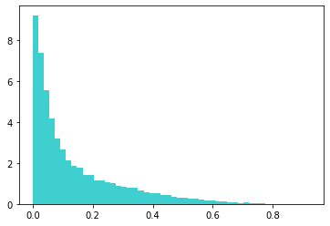
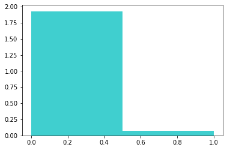

# Bertelsmann Classifier Project
## Udacity Capstone Project

### *Dr Hannah Costa*

The project brief was given as follows:

# Capstone Project: Create a Customer Segmentation Report for Arvato Financial Services

In this project, you will analyze demographics data for customers of a mail-order sales company in Germany, comparing it against demographics information for the general population. You'll use unsupervised learning techniques to perform customer segmentation, identifying the parts of the population that best describe the core customer base of the company. Then, you'll apply what you've learned on a third dataset with demographics information for targets of a marketing campaign for the company, and use a model to predict which individuals are most likely to convert into becoming customers for the company. The data that you will use has been provided by our partners at Bertelsmann Arvato Analytics, and represents a real-life data science task.

The versions of those two datasets used in this project will include many more features and has not been pre-cleaned. You are also free to choose whatever approach you'd like to analyzing the data rather than follow pre-determined steps. In your work on this project, make sure that you carefully document your steps and decisions, since your main deliverable for this project will be a blog post reporting your findings.

---

To complete the project I have split the project into 4 stages with their own notebooks and a selection of function files that break down the processes for each stage. 

|Script| Description |
|-------|----------|
|0_Clean_data.ipynb| The project has four datasets that need to be explored and cleaned so they can be modeled and compared. This script outlines that process and saves clean data at the end.|
|1_Customer_segmentation| This scripts applied the PCA transformation and works out a suitable number of factors that cen be brought forward for clustering and further modelling. It also analyses the suitable number of clusters to use and the clustering analysis was performed for 16 clusters and saved.|
|2_Supervised_learning_model| This script explores class imbalance and model tuing for an XGBoost tree model. The model tuning ran for 2 and a half days and the best parameters model was saved. |
|3_model_analysis| The previuos script generate an .md results file for the model tuning so those metrics can be used in the analysis. This script does further analysis using the validation and the Test dataset. I also bring in some model metrics form teh last stage which was Logistic Regression.  |
|4_Logistic_regress| Even with steps to aid the class imbalance the XGBoost model response distribution is poor and struggles to predict any one that would given a positive response. This script explores balancing using Logistic Regression.|

---

This document will summarise each of these stages and key results from each. 

## 1. Customer Segmentation

The PCA analysis sought to reduce the number of factors down from ~ 400 (after encoding) to make teh models easier to run and avoid over fitting when fewer factors can account for the satistical variance in the dataset. I set a threshold of 80% cumulative variance to be explained and the number of factors brought through was 145. 

An analysis on the number of clusters to aim for was performed and I made teh decision to use 16 clusters.

The clustering analysis was done on the Azdias data and the clusters applied to the customer data to show which clusters are over or under represented by Bertelsmann.

|result|Cluster|
|-------|------------|
|Over represented - current customer base| 13, 11, 10|
|Under Represented | 16, 3, 6, 15, 7, 2, 3|

The remaining clusters were closer to being evenly represented between customer and population base. 

Depending on the objects of the mail out campaign it is a little difficult to offer strategy advice on this data alone, even with the top factors that describe the clusters. If the goal of the campaign to increase customers in areas that it's under represented, i.e. to a new demographic we need more stake holder knowledge to ensure you don't send out what the equivalent of sending out promotions for kids toys to a demographic that are single adults household; or home insurance advertisement to student renters etc 

I did note that a lot of the correlated factors are wealth and social indicators so we would need to be extremely concious about what goes into anykind of modelling, especially if it impacts customer price. i.e. you can price motor insurance based on car make and location even if that indicate affluence because it relates to the burn cost of taking a policy out but you can't model policy price based off precieved shopping behaviour of customers.

## 2. Supervised Learing Models

There are so many options for modelling and modelling tuning that to comply with the brief I chose early on to do an XGBoost model and address the class imbalance before hand. I tuned over a fairly large paramter grid and saved the results to it's own md file that can be viewed. 

The model resuts for log loss and predictability looked fine even on the validation set:

    The max mean train score is -0.0021508678072083977.

    The max mean test score is -0.02951969465658931.

    The model predicted neg log loss on TEST is -0.02451040293835604.

But the reliability diagram looked a bit off and the model probably isn't that good on new data. 

The next stage explored this further.

## 3. Model Analysis

With the XGBoost model looking a bit unreliable a checked out the distributions for the predicted respone in TEST. th emodel was only able to find one row which it predicted (probability = 0.51) to be an accepted RESPONSE. 

I decided to do a Log based model to balance the distriution as I was not confident in submitting the tree based model predictions.

## 4. Logistic Regression

I experimented with different levels of sampling for the class imbalance and used the confusion matrix to look closer at percision to balance the model. In the end I decided on a sampling SMOTE rate of 20%.

The predicted distribution looked much more balanced. 

## Conclusion

These type of conversion models are tricky because of their class imbalance can dominate the modeling process and lead to over fitting or putting much more importances in some features just because its distribution in a very small subset. D19_SOZIALES was the most predictive factor in teh XGBoost model and has a might higher populated level= 1.0 in its level mapping compared to teh dataset as a whole. The factor documentation didn't cover this factor but it's clear that it's a social indicator and must be considered carefully the purpose and impact of the model before using it all. thi sis where I would engage with the company stakeholders for more informations. 

The Logistic Regression was easier to balance and believe the the prediction for TEST will be better than teh XGBoost model. Again, without being able to explore the data ethics behind teh purpose of the model and mail out campaign I would hesitate to use it as even geting feature importance out is tricky. 

A further step to the project given more information about objects I would seperate the data by clusters to model conversion over different customer segmentations. 

### note
 All Bertelsmann data provided will be deleted after 7 days from submission, both locally and on GIT.  