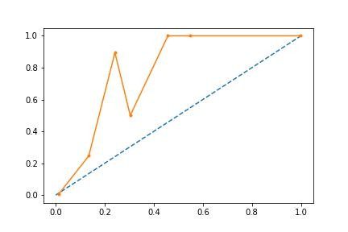

# Model tuning best results
Results file for best modelling results for trial `XGBoost_test_1`.'

---

The tuning parameter grid:

```json
{
  "learning_rate": [0.01,0.05,0.1,0.15,0.2,0.25],
  "max_depth": [1,2,3,4,5,6,7],
  "min_child_weight": [2,3,4,5,6],
  "colsample_bytree": [0.6,0.65,0.7,0.75,0.8,0.85,0.9],
  "gamma": [0,0.1,0.2,0.4]
}
```

The best_params_ grid from function is 
```json
{
  "colsample_bytree": 0.9,
  "gamma": 0.2,
  "learning_rate": 0.1,
  "max_depth": 7,
  "min_child_weight": 2
}
```

The max mean train score is -0.0021508678072083977.

The max mean test score is -0.02951969465658931.

The model predicted neg log loss on TEST is -0.02451040293835604.

---

The reliabilty diagram:


---

Top 20 features by importance:

```python
            feature name  importance
62          D19_SOZIALES       0.137
63           D19_TECHNIK       0.047
106           HEALTH_TYP       0.039
52     D19_KONSUMTYP_MAX       0.034
55             D19_LOTTO       0.031
34           D19_BILDUNG       0.031
98             FINANZTYP       0.030
114          KBA05_ANTG1       0.027
101   GEBAEUDETYP_RASTER       0.026
140         KBA05_KRSZUL       0.024
132      KBA05_HERSTTEMP       0.021
124         KBA05_DIESEL       0.020
115          KBA05_ANTG2       0.019
36           D19_BUCH_CD       0.018
33   D19_BEKLEIDUNG_REST       0.018
138        KBA05_KRSOBER       0.015
99          FIRMENDICHTE       0.013
119         KBA05_BAUMAX       0.012
16             CJT_TYP_1       0.012
43     D19_GESAMT_ANZ_24       0.012
```

